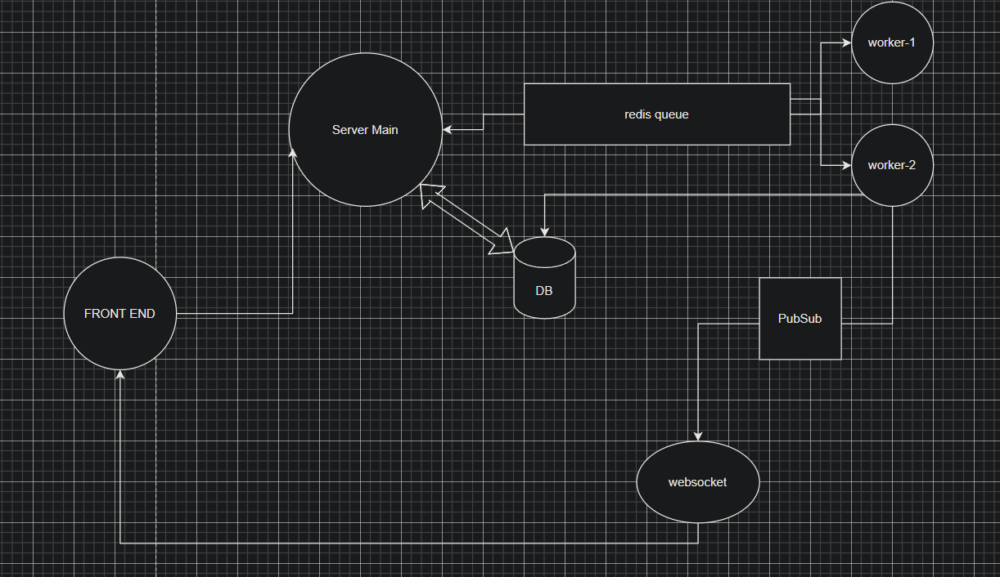

# CodeCrack

## Architecture Of The Application



## Running the Application Locally

Clone the Project
```
git clone https://github.com/ShauryaSood2003/CodeCrack
```
Run to Install Dependencies
```
cd frontEnd
npm install
```
```
cd backend
npm install
```
```
cd workers
npm install
```

## Run prisma using Docker 
Important
- Replace the **.env.example** file with **.env** file inside the backend folder
```
docker run -e POSTGRES_PASSWORD="password" -d -p 5432:5432 postgres
```
```
npx prisma generate
```
> You can also use prisma cloud provider just replace the url link in **.env** file 
> [Neon](https://neon.tech/) 
> [Avion](https://www.avion.io/)

## Run Redis Locally
```
docker run --name my-redis -d -p 6379:6379 redis
```